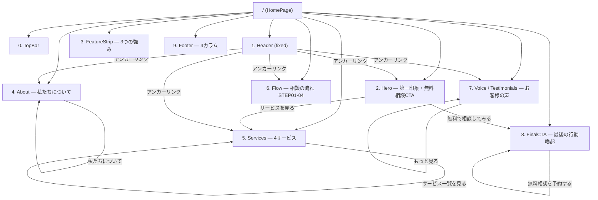

# ワイヤーフレーム定義 — MERIDIAN Financial Planning
> 設計者: UXアーキテクト・椎名真昼
> 設計方針: 1ページ1メッセージ / 導線を一筆書きで描く / 空白は素材

---

## サイトマップ



---

## ユーザージャーニー（理想の一筆書き）

```
訪問
  ↓
TopBar: 信頼シグナル（独立系FP・連絡先）→ 読み飛ばし可
  ↓
Header: ブランド認識 → ナビ探索
  ↓
Hero[高さ760px]: ブランド世界観を3秒で受容 → CTAへ誘引
  ↓
FeatureStrip: 「なぜMERIDIAN?」を3点で補強 → 離脱防止
  ↓
About: 人格・哲学への共感 → 信頼構築
  ↓
Services: 自分のニーズとのマッチング → 具体的興味
  ↓
Flow: 「相談のハードルは低い」の安心感 → 行動意欲
  ↓
Voice: 社会的証明 → 最後の迷いを除去
  ↓
FinalCTA: コンバージョン
```

---

## セクション別ワイヤー定義

---

### 0. TopBar

```
[ · INDEPENDENT FINANCIAL PLANNING · ]         [ 📞 03-XXXX-XXXX  |  平日 9:00–18:00 ]
```

- bg: 最も深いダーク `#06101e`
- 高さ: 36px（padding 8px × 48px）
- フォント: 11px / mono / gold
- 役割: 「独立系・連絡先」の信頼シグナルを最上部に配置。離脱を防ぐ錨。

```markdown
## TopBar
- [ ] 左: INDEPENDENT FINANCIAL PLANNING（mono・gold・大文字）
- [ ] 右: 電話番号 + 営業時間（mono・cream・muted）
- [ ] 高さ: 36px固定
- [ ] 全幅ダーク帯
```

---

### 1. Header（固定・スクロール反応型）

```
[ MERIDIAN            ]  [ホーム] [私たちについて] [サービス] [ご相談の流れ] [お客様の声] [コラム]  [無料相談を予約する ↗]
[ FINANCIAL PLANNING  ]
```

**2状態を持つ：**

| 状態 | bg | blur | border-bottom | padding-y |
|------|-----|------|---------------|-----------|
| 初期（top） | transparent | なし | なし | 22px |
| スクロール40px超 | rgba(10,22,40,0.92) | blur(12px) | 1px gold-22% | 14px |

```markdown
## Header
- [ ] Logo: 左端（2段組: MERIDIAN / FINANCIAL PLANNING）
- [ ] Nav: 中央（6項目・13px・gap 38px・hover→gold）
- [ ] CTA Button: 右端「無料相談を予約する」（メールアイコン付き・gold border）
- [ ] Fixed: position sticky / z-index: 50
- [ ] Scroll state: scrollY > 40 でガラス化
- [ ] Transition: 0.4s ease
```

---

### 2. Hero（height: 760px）

```
┌─────────────────────────────────────────────────────────────────────────┐
│  [背景: ダーク + SVGスカイライン + Orbグロー]                             │
│                                                                           │
│                              ┌──────────────────────────────────────┐   │
│                              │  — FOR YOUR FUTURE             (eyebrow)│  │
│                              │                                        │   │
│                              │  未来の選択肢を、                        │  │
│                              │  今の[戦略]で広げる。            (H1)   │   │
│                              │  ─────────────── (gold rule 48px)     │   │
│                              │  サブコピー（17px muted 2行）            │  │
│                              │                                         │  │
│                              │  [無料で相談してみる →]  [サービスを見る]│   │
│                              └──────────────────────────────────────┘   │
│                                                                           │
│                          ↓ SCROLL                                        │
└─────────────────────────────────────────────────────────────────────────┘
```

```markdown
## Hero
- [ ] 高さ: 760px / フルブリード
- [ ] 背景: ダーク bg-deep + SVGスカイライン + ドット60点（gold微光）
- [ ] コピーブロック: 右寄せ、width 620px
  - [ ] Eyebrow: "— FOR YOUR FUTURE"（mono・gold・大文字）
  - [ ] H1: "未来の選択肢を、／今の戦略で広げる。"（"戦略"のみgold）
  - [ ] Gold rule: 48px × 1px
  - [ ] サブコピー: 17px / line-height 2 / muted
  - [ ] CTA 1: btn-gold「無料で相談してみる」
  - [ ] CTA 2: btn-ghost-light「サービスを見る」
- [ ] Scrollインジケータ: 下中央・縦線フェード
- [ ] 出現: Framer Motion fadeUp（H1は0.2s遅延）
```

---

### 3. FeatureStrip（Hero overlap -80px）

```
┌─────────────────────────────────────────────────────────────────────────┐
│ bg: bg-deep-2 / border: 1px gold-22%                                    │
│                                                                           │
│  [🌙アイコン]  中立的な立場    │  [📊アイコン]  資産形成のプロ  │  [🛡アイコン]  長期サポート  │
│   テキスト説明 13px           │   テキスト説明 13px            │   テキスト説明 13px         │
└─────────────────────────────────────────────────────────────────────────┘
```

```markdown
## FeatureStrip
- [ ] margin-top: -80px（Heroにオーバーラップ）
- [ ] 3カラムグリッド（gap: 0、border-right区切り）
- [ ] 各セル: icon（gold, 左） + title（serif 18px） + body（sans 13px）
- [ ] 外枠: 1px gold-22%
- [ ] bg: bg-deep-2
- [ ] 内側の分割線: 1px gold-22%
```

---

### 4. About（cream bg）

```
┌─────────────────────────────────────────────────────────────────────────┐
│ bg: bg-cream / padding: 160px 0 140px                                   │
│                                                                           │
│  ┌─────────────────────────┐    ┌──────────────────────────────────┐   │
│  │ ABOUT                    │    │                                   │   │
│  │                          │    │  [デスクトップ合成画像 4:3]       │   │
│  │ お金の不安を安心に変え、    │    │  （本番: マーブルデスク写真）       │  │
│  │ 理想の人生をデザインする。  │    │                                   │   │
│  │ ─────── (gold rule)      │    │                                   │   │
│  │ 本文テキスト              │    │                                   │   │
│  │ [私たちについて →]        │    └──────────────────────────────────┘   │
│  └─────────────────────────┘                                            │
└─────────────────────────────────────────────────────────────────────────┘
```

```markdown
## About
- [ ] bg: bg-cream / 2カラム（1fr × 1.1fr, gap 80px）
- [ ] 左カラム:
  - [ ] Eyebrow "ABOUT"
  - [ ] H2: "お金の不安を安心に変え、理想の人生をデザインする。"（serif 40px）
  - [ ] Gold rule 48px
  - [ ] Body text（sans 15-17px / line-height 2）
  - [ ] btn-outline「私たちについて」
- [ ] 右カラム: 画像プレースホルダー（aspect 4:3）
- [ ] scroll-reveal: fadeUp（左→右 stagger 0.12s）
```

---

### 5. Services（dark bg）

```
┌─────────────────────────────────────────────────────────────────────────┐
│ bg: bg-deep / padding: 140px 0                                           │
│                                                                           │
│                    SERVICE                                               │
│         お客様の目標に合わせた最適な[サポート]を提供します                  │
│                                                                           │
│  ┌──────┐   ┌──────┐   ┌──────┐   ┌──────┐                           │
│  │CITY  │   │FAMILY│   │CONTRACT│  │HOUSE │                            │
│  │──────│   │──────│   │────────│  │──────│                            │
│  │01・   │   │02・   │   │03・    │   │04・  │                            │
│  │PORTF │   │LIFE  │   │INSUR.  │   │MORT. │                            │
│  │アイコン│   │アイコン│   │アイコン │   │アイコン│                            │
│  │タイトル│   │タイトル│   │タイトル │   │タイトル│                            │
│  │短文  │   │短文  │   │短文   │   │短文  │                            │
│  └──────┘   └──────┘   └──────┘   └──────┘                           │
│                  hover: translateY(-6px) + border→gold                  │
│                                                                           │
│                    [サービス一覧を見る →]                                 │
└─────────────────────────────────────────────────────────────────────────┘
```

```markdown
## Services
- [ ] bg: bg-deep / 4カラムグリッド（gap 24px）
- [ ] 中央タイトル: Eyebrow + H2
- [ ] ServiceCard × 4:
  - [ ] 上部画像エリア（aspect 5:3、SVGプレースホルダー）
  - [ ] メタ: "01 · PORTFOLIO"（10px gold mono）
  - [ ] アイコン + タイトル（serif 18px）
  - [ ] 短文テキスト（13px muted）
  - [ ] hover: translateY(-6px) + border-color→gold（0.4s ease）
- [ ] 下部: btn-ghost-light「サービス一覧を見る」
- [ ] stagger reveal: 0.08s間隔
```

---

### 6. Flow（cream-2 bg）

```
┌─────────────────────────────────────────────────────────────────────────┐
│ bg: bg-cream-2 / padding: 160px 0 140px                                  │
│                                                                           │
│                     FLOW    ご相談の流れ                                  │
│                                                                           │
│  ━━━━━━━━━━━━━━━━━━━━━━━━━━━━━━━━━━━━━━━━━━━━━━━━━  ← gold gradient line│
│  ○           ○           ○           ○                                 │
│  STEP 01     STEP 02     STEP 03     STEP 04                           │
│  ・CONTACT・  ・HEARING・  ・PROPOSAL・ ・SUPPORT・                       │
│  お問い合わせ  ヒアリング   プランご提案  実行と継続                        │
└─────────────────────────────────────────────────────────────────────────┘
```

```markdown
## Flow
- [ ] bg: bg-cream-2 / 4カラムグリッド
- [ ] 接続線: gold グラデーション（left 8% → right 8%, top 64px）
- [ ] 円形アイコン: 128×128px, cream bg, 1px gold border
  - 中: "STEP" mono 10px / "01" latin-serif 38px
- [ ] 各ステップ:
  - [ ] mono メタ "· CONTACT ·"（大文字・gold）
  - [ ] タイトル（serif 20px）
  - [ ] body（13px / line-height 1.9）
- [ ] stagger reveal: 0.10s間隔
```

---

### 7. Voice / Testimonials（cream bg）

```
┌─────────────────────────────────────────────────────────────────────────┐
│ bg: bg-cream / padding: 140px 0 120px                                   │
│                                                                           │
│                     VOICE   お客様の声                                   │
│                                                                           │
│  ┌──────────────────┐  ┌──────────────────┐  ┌──────────────────┐     │
│  │ "            (64px│  │ "                │  │ "                │     │
│  │ [avatar] CASE 01 │  │ [avatar] CASE 02 │  │ [avatar] CASE 03 │     │
│  │ 30代・会社員      │  │ 40代・自営業      │  │ 50代・主婦       │     │
│  │ 引用テキスト      │  │ 引用テキスト      │  │ 引用テキスト      │     │
│  └──────────────────┘  └──────────────────┘  └──────────────────┘     │
│                                                                           │
│  ※個人の感想であり、成果を保証するものではありません。（11px muted）         │
│                              [もっと見る →]                               │
└─────────────────────────────────────────────────────────────────────────┘
```

```markdown
## Voice
- [ ] bg: bg-cream / 3カラムグリッド（gap 24px）
- [ ] TestimonialCard × 3:
  - [ ] 大型gold引用符（64px, opacity 0.5）
  - [ ] アバター: 丸44px（dark bg + gold icon）
  - [ ] CASE 01 mono + 属性テキスト
  - [ ] 引用テキスト（13.5px / line-height 2）
  - [ ] bg: bg-cream-2 / border: 1px line-on-cream / padding: 40×32px
- [ ] 下部注記（11px muted）
- [ ] btn-outline「もっと見る」
```

---

### 8. FinalCTA（dark bg）

```
┌─────────────────────────────────────────────────────────────────────────┐
│ bg: bg-deep / padding: 120px 0                                           │
│                                                                           │
│              [radial gold decoration + 30点ドット]                        │
│                                                                           │
│                        CONTACT                                           │
│            資産運用の第一歩を、私たちと一緒に。（44px serif）                │
│                                                                           │
│          [無料相談を予約する →]    [📞 03-XXXX-XXXX  平日9-18時]          │
│                                                                           │
└─────────────────────────────────────────────────────────────────────────┘
```

```markdown
## FinalCTA
- [ ] bg: bg-deep / 中央揃え
- [ ] Eyebrow "CONTACT"
- [ ] H2: "資産運用の第一歩を、私たちと一緒に。"（44px serif）
- [ ] 装飾: gold radial gradient + ドット30点
- [ ] CTA 1: btn-gold「無料相談を予約する」
- [ ] CTA 2: btn-ghost-light（PhoneIcon + 電話番号 + 営業時間）
```

---

### 9. Footer（`#06101e`）

```
┌─────────────────────────────────────────────────────────────────────────┐
│                                                                           │
│  ┌──────────────────┐  ┌──────────┐  ┌──────────┐  ┌──────────────┐  │
│  │ MERIDIAN          │  │ SERVICE  │  │ COMPANY  │  │ CONTACT      │  │
│  │ FINANCIAL PLANNING│  │・資産運用 │  │・会社概要 │  │ 〒XXX-XXXX  │  │
│  │ 説明テキスト       │  │・ライフプラン│ │・プライバシー│ │ 電話番号     │  │
│  │                  │  │・保険見直し│  │・利用規約 │  │ メール       │  │
│  │                  │  │・ローン相談│  │・コラム  │  │              │  │
│  └──────────────────┘  └──────────┘  └──────────┘  └──────────────┘  │
│                                                                           │
│  ──────────────────────── (1px gold-22% border) ────────────────────── │
│  © 2025 MERIDIAN Financial Planning. All rights reserved.               │
│                      プライバシーポリシー  │  特定商取引法  │  免責事項     │
│                                                                           │
└─────────────────────────────────────────────────────────────────────────┘
```

```markdown
## Footer
- [ ] bg: #06101e / padding: 80px 0 32px
- [ ] 4カラム（1.4fr / 1fr / 1fr / 1fr, gap 48px）
  - [ ] Col 1: Logo + 説明文
  - [ ] Col 2: SERVICE リスト（4項目）
  - [ ] Col 3: COMPANY リスト
  - [ ] Col 4: CONTACT（住所・電話・メール）
- [ ] 下部: 1px gold-22% border → copyright + 法務リンク3本
```

---

## 導線設計まとめ

### 主要コンバージョンパス（高意欲ユーザー）
```
Header CTA → FinalCTA [無料相談を予約する]
Hero CTA 1 → FinalCTA [無料相談を予約する]
```

### 探索パス（中意欲ユーザー）
```
Hero CTA 2 → Services → Flow → Voice → FinalCTA
```

### 情報収集パス（低意欲ユーザー）
```
About → Services → Flow → Voice（→ 後日再訪問）
```

---

## 設計上の判断メモ

1. **FeatureStripの-80px overlap**: Heroからの視線をそのまま受け取るため。スクロールの「区切り感」を消す。
2. **セクション数10個（上限）**: brief.md 通り。情報過多にならないギリギリのライン。
3. **CTAボタンを3箇所に分散**: Hero / Services下部 / FinalCTA。「気づいたタイミング」でいつでも相談できる。
4. **Flowセクションの位置**: Servicesの後に「どう動けばよいか」を提示。行動のハードルを下げる。
5. **Voiceの位置（FinalCTAの直前）**: 社会的証明を最後の背中押しとして使う。

---

*椎名真昼 — ワイヤー完了。構造に迷いなし。*
